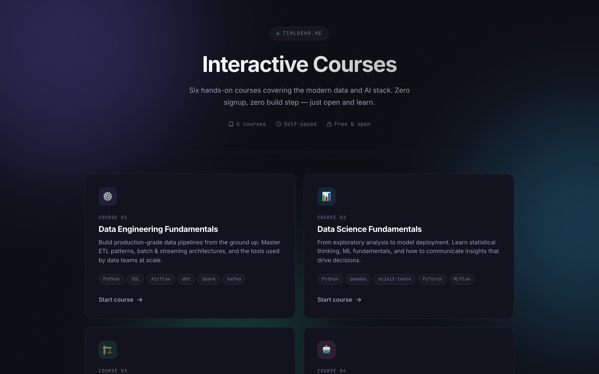
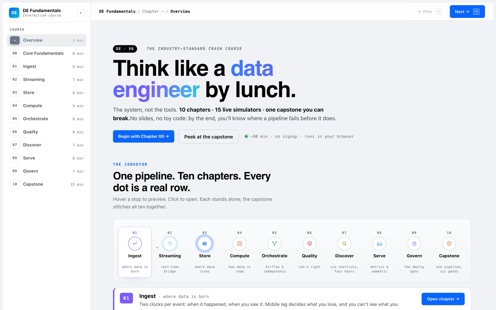
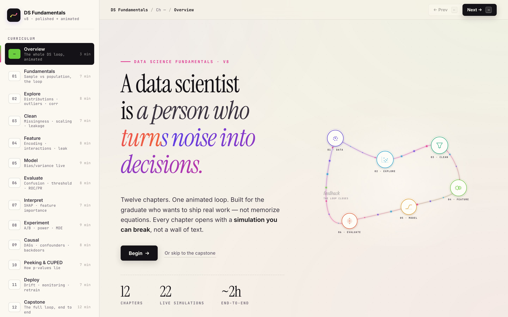
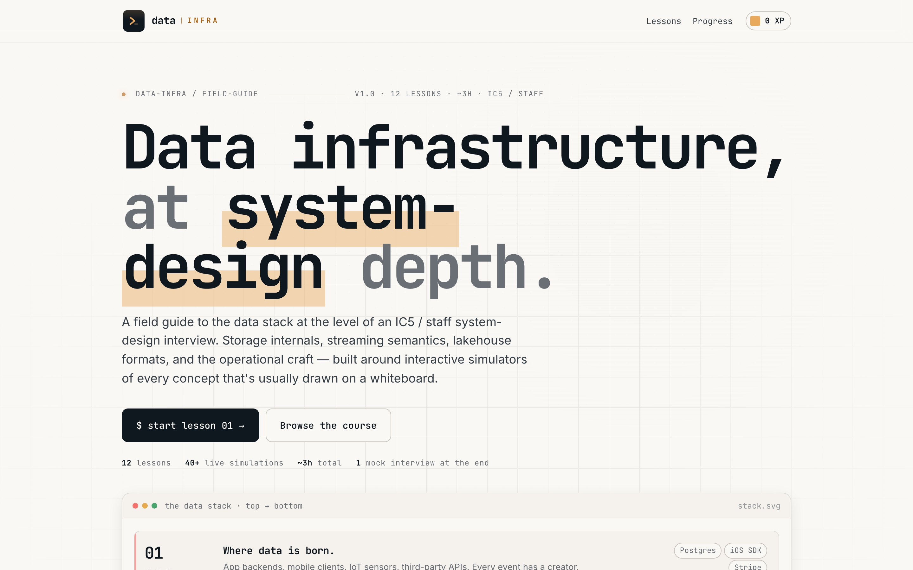
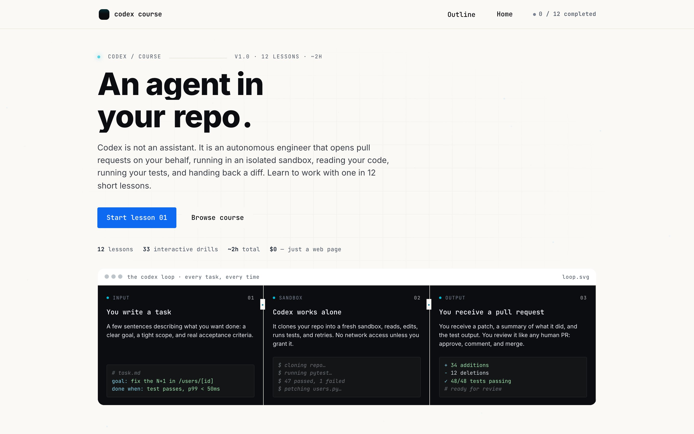
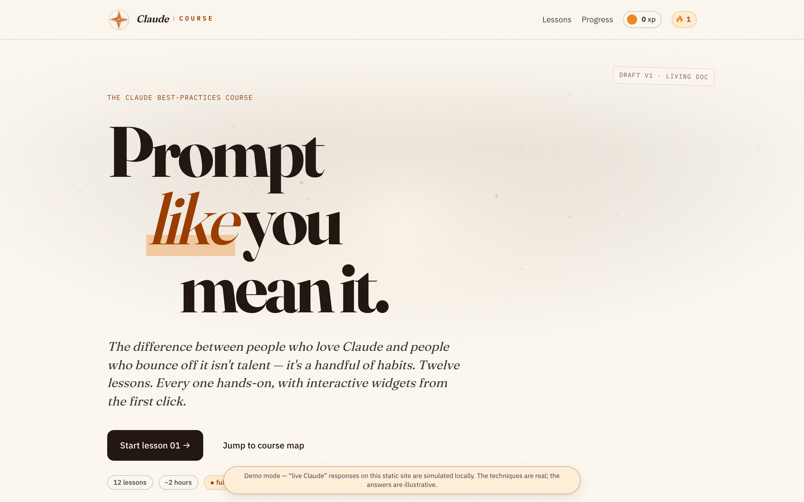
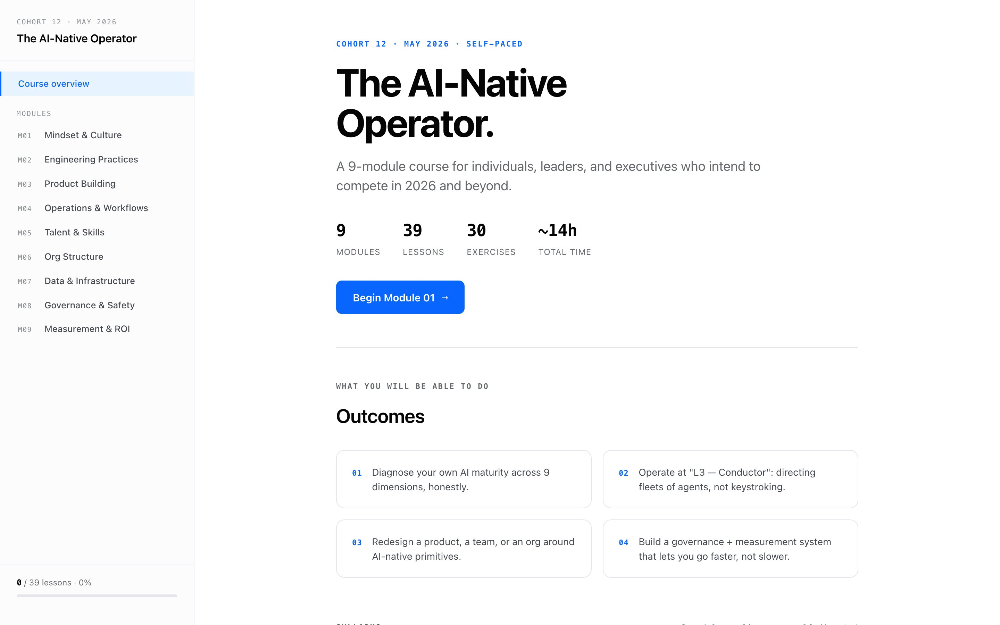

<div align="center">

# Interactive Courses

### Learn the modern data + AI stack by *doing* — six interactive courses that run entirely in your browser.

No signup. No install. No video. Open `index.html` and start learning — many lessons embed **live, in-browser simulators** you can poke, break, and rebuild.

<br/>

[](./LICENSE)
[](#-course-gallery)
[](#-run-locally)
[](https://www.timloehr.me/interactive-courses/)
[](#-what-makes-these-different)
[](./CONTRIBUTING.md)
[](https://www.timloehr.me/interactive-courses/)

<br/>

<a href="https://www.timloehr.me/interactive-courses/">
  
</a>

<br/>
<br/>

### ▶ **[Open the live site →](https://www.timloehr.me/interactive-courses/)**

</div>

---

## Why this exists

- **Zero signup, zero install** — no account, no email wall, no `npm install`. Clone or click and learn.
- **Runs 100% in the browser** — every course is static HTML/CSS/JS. No backend, no API keys, no database.
- **Real interactive simulators, not videos** — change an input, watch the system respond: Kafka consumer groups, event-time watermarks, CDC flows, partition skew, bloom filters, A/B-test power, causal DAGs, and more.
- **Works offline** — open `index.html` from disk with no network and it still works.
- **Open source, MIT** — fork it, remix it, teach from it.

---

## 📚 Course Gallery

<table>
<tr>

<td width="50%" valign="top">
  <a href="./data-engineering-fundamentals/">
    
  </a>
  <h3><a href="./data-engineering-fundamentals/">Data Engineering Fundamentals</a> 🏗️ <em>flagship</em></h3>
  <p>Build production-grade data pipelines from the ground up: ETL patterns, batch + streaming, partitioning, orchestration, and data quality.</p>
  <p><strong>10 chapters · ~15 live simulators</strong></p>
  <p>
    
    
    
    
    
    
  </p>
</td>

<td width="50%" valign="top">
  <a href="./data-science/">
    
  </a>
  <h3><a href="./data-science/">Data Science Fundamentals</a> 🔬</h3>
  <p>From exploratory analysis to model deployment: statistical thinking, CLT, bias/variance, ROC/PR, SHAP, A/B-test power, causal DAGs, drift — plus a full capstone.</p>
  <p><strong>13 chapters · live sims throughout</strong></p>
  <p>
    
    
    
    
    
  </p>
</td>

</tr>
<tr>

<td width="50%" valign="top">
  <a href="./data-infrastructure/">
    
  </a>
  <h3><a href="./data-infrastructure/">Data Infrastructure</a> 🧱</h3>
  <p>The data stack at staff-engineer system-design depth: storage internals, CAP/PACELC, modeling, Parquet/ORC/Avro, lakehouse (Iceberg/Delta/Hudi), streaming + watermarks, CDC/Lambda/Kappa, idempotency, SLAs.</p>
  <p><strong>12 lessons · 7 interactive widgets</strong></p>
  <p>
    
    
    
    
    
  </p>
</td>

<td width="50%" valign="top">
  <a href="./codex/">
    
  </a>
  <h3><a href="./codex/">Codex Course</a> 🤖</h3>
  <p>A terminal-first playbook for the OpenAI coding agent. Mental model, sandboxing, <code>AGENTS.md</code>, task specs, scoping, acceptance criteria, code review, iteration, tool use, and parallel workflows.</p>
  <p><strong>12 lessons + capstone</strong></p>
  <p>
    
    
    
    
    
  </p>
</td>

</tr>
<tr>

<td width="50%" valign="top">
  <a href="./claude/">
    
  </a>
  <h3><a href="./claude/">Claude Course</a> 💬</h3>
  <p>Prompt like you mean it — the handful of habits that separate people who love Claude from people who bounce off it: prompt anatomy, context engineering, <code>CLAUDE.md</code>, iteration, agents &amp; tool use, grounding, evals, and safety.</p>
  <p><strong>12 lessons</strong></p>
  <p>
    
    
    
    
    
  </p>
</td>

<td width="50%" valign="top">
  <a href="./ai-native/">
    
  </a>
  <h3><a href="./ai-native/">The AI-Native Operator</a> 🧭</h3>
  <p>An operating model for working AI-native: the mindset, engineering practice, and org design for shipping with AI agents. A hash-routed journey with interactive exercises and quizzes.</p>
  <p><strong>9 modules · 39 lessons</strong></p>
  <p>
    
    
    
    
    
  </p>
</td>

</tr>
</table>

---

## 🚀 Run locally

**There is no build step.** No bundler, no transpiler, no `node_modules`. Clone and open a file.

```bash
git clone https://github.com/Mavengence/interactive-courses.git
cd interactive-courses

# Option A — just open the landing page in your browser
open index.html          # macOS  (use `xdg-open` on Linux, `start` on Windows)

# Option B — serve it (recommended; keeps relative paths happy)
python3 -m http.server 8080
# then visit http://localhost:8080/
```

Each course lives in its own folder and ships its own `index.html`, so you can jump straight in:

```bash
open data-engineering-fundamentals/index.html
open data-science/index.html
open data-infrastructure/index.html
open codex/index.html
open claude/index.html
open ai-native/index.html
```

---

## ✨ What makes these different

- **You learn by doing.** Live, in-browser simulators turn abstract ideas — watermarks, CAP trade-offs, partition skew, statistical power — into things you can manipulate and feel.
- **Staff-level depth, not a tutorial.** The infrastructure and data-engineering courses go to system-design depth used in senior interviews and real platform work.
- **Genuinely offline.** No CDNs to break, no telemetry, no login. The whole thing is yours on disk.
- **Open source.** MIT licensed — read the code, fork a course, adapt it for your team, or contribute back.

---

## 🤝 Contributing

Improvements of every size are welcome — a typo fix, a clearer explanation, a better simulator, or a whole new lesson. Start with **[CONTRIBUTING.md](./CONTRIBUTING.md)**, then [open an issue](https://github.com/Mavengence/interactive-courses/issues) or send a PR.

---

## ⭐ If these helped you

If a simulator made something finally click, **leave a star** — it takes a second and it genuinely helps other engineers find these courses.

<div align="center">

### ⭐ [Star this repo](https://github.com/Mavengence/interactive-courses) &nbsp;·&nbsp; ▶ [Open the live site](https://www.timloehr.me/interactive-courses/)

</div>

---

## License

[MIT](./LICENSE) — free to use, adapt, and share. Built by [Tim Löhr](https://www.timloehr.me) · [@Mavengence](https://github.com/Mavengence).
